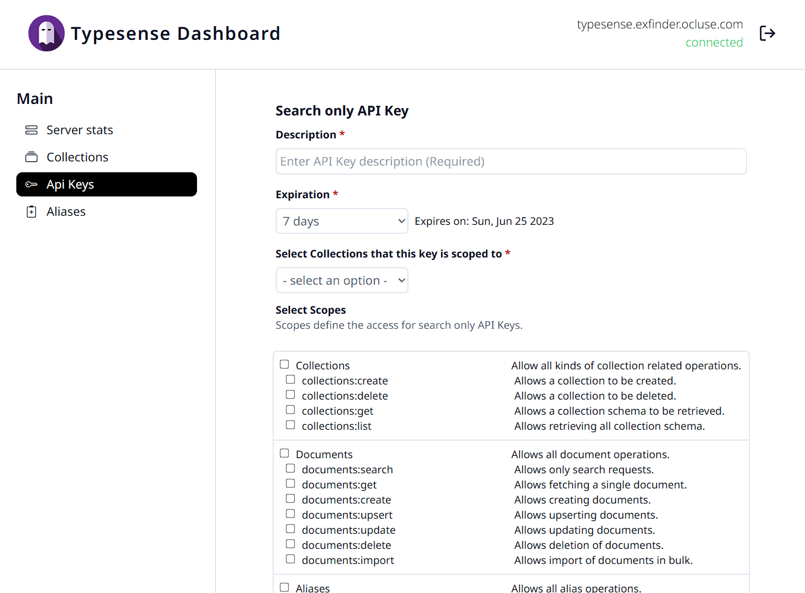
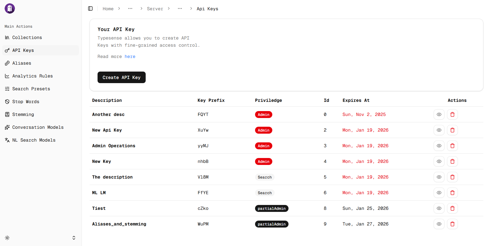

# **Typesense admin dashboard**





## Project goals

The project aims to provide a user friendly interface to manage your typesense server.

### Quick setup Using Docker compose

- [`docker-compose.yaml`](./docker-compose.yaml)

  ```yml
  name: typesense
  services:
    typesense:
      container_name: typesense
      image: typesense/typesense:29.0
      restart: unless-stopped
      ports:
        - "127.0.0.1:8108:8108"
      volumes:
        - ./data:/data
      networks:
        - typesense
      command:
        - "--data-dir=/data"
        - "--api-key=xyz"
        - "--enable-cors"

    dashboard:
      container_name: typesense_dashboard
      image: ghcr.io/lewynation/typesense-admin-dashboard:latest
      restart: unless-stopped
      ports:
        - "127.0.0.1:3000:3000"
      networks:
        - typesense
      environment:
        - BETTER_AUTH_SECRET=pass-a-secure-secret
        - DISABLE_REGISTRATION=false
      volumes:
        - frontend-data:/app/data

  volumes:
    frontend-data:

  networks:
    typesense:
      external: true
  ```

  Runs the dashboard alongside the typesense server. Exposes the dashboard on port `3000` and typesense on port `8108`. Perfect for development or just trying out the dashboard. Provide a suitable typesense server API Key by modifying the `--api-key` flag. Ensure that cors is enabled on the typesense server with the `--enable-cors` flag. Typesense does not have a latest tag on the Docker Hub. You can find a list of all available tags [here](https://hub.docker.com/r/typesense/typesense/tags).

## Configuration

The dashboard can be configured using the following environment variables:

- `BETTER_AUTH_SECRET`: Secret key used to encrypt user sessions.
- `DISABLE_REGISTRATION`: If set to `true`, user registration is disabled. Defaults to `false`.

## Connection Gotchas

Where is localhost?

- If you have the dashboard running as a docker container and want to connect to a locally running typesense instance (i.e typesense not in docker, say on your host machine), then when adding a server simply use `host.docker.internal` as the host.OR run the dahsboard container with network mode set to `host` and connect to your typesense server using `localhost` as the host.

- If you have both the typesense server and the dashboard running in docker, then you can use the server's service name as the hostname to connect to it. Provided the two containers are in the same network.

Perfect for situations where you don't want to expose your typesense server to the outside world.

## Useful Links

- [Typesense](https://typesense.org/)
